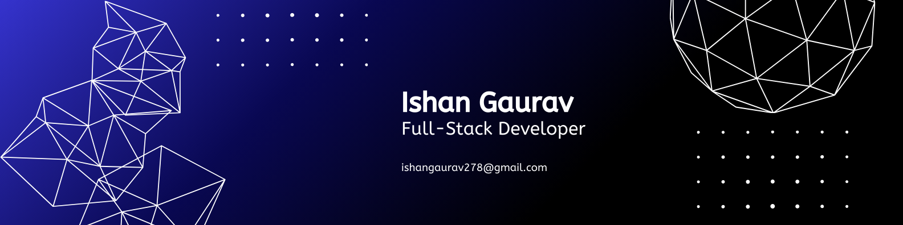

<!--Banner-->

<!--Header Name-->
#  ɪ'ᴍ Ishan Gaurav! 

<!--Start Intro-->               
I am a **Full Stack Developer** Studying ECE in BIT Mesra , Passionate about building Robust and Scalable Web-Application . I love the challenge of turning complex problems into beautiful, simple solutions.

## 🔭 I’m Currently Working On

* Build [Car-Rental](https://github.com/IshanGaurav/Car-Rental), A Web-Based Platform where you can for vehicle discovery, booking, and rental management.
* Build [Bill-Buddies](https://github.com/IshanGaurav/BillBuddies) , Developed a scalable full-stack web application supporting group and individual expense management.
* Learning advance backend communications using microservices.
* Learning DSA and Increasing my Problem Solving Skills.

## 💻 My Tech Stack
* **Languages:** JavaScript (ES6+), Python, HTML5, CSS3 , JAVA, C++
* **Frameworks:** React, Node.js, Express, Next.JS
* **Databases:** MongoDB, PostgreSQL
* **Tools:** Git, Docker, GitHub , Postman , Redis

Here are a few technologies and concepts I've been working with:

## 💻 My Tech Stack

Here are a few technologies and concepts I've been working with:

  <table>
    <tr>
      <td align="center" width="96">
        
         HTML5
      </td>
      <td align="center" width="96">
        
         CSS3
      </td>
      <td align="center" width="96">
        
         JavaScript
      </td>
      <td align="center" width="96">
        
         TypeScript
      </td>
    </tr>
    <tr>
      <td align="center" width="96">
        
         React
      </td>
      <td align="center" width="96">
        
         Next.js
      </td>
      <td align="center" width="96">
        
         Tailwind CSS
      </td>
      <td align="center" width="96">
        
         Figma
      </td>
    </tr>
    <tr>
      <td align="center" width="96">
        
         Java
      </td>
      <td align="center" width="96">
        
         Docker
      </td>
      <td align="center" width="96">
        
         MongoDB
      </td>
      <td align="center" width="96">
        
         Redis
      </td>
    </tr>
  </table>

<!--Github stats Table--> 
<h2 align="center">📊 Gɪᴛʜᴜʙ Sᴛᴀᴛs 📊</h2>

<table width="100%">
  <tr>
    <td width="50%">
      <h3 align="center"><strong>Gɪᴛʜᴜʙ Sᴛᴀᴛs</strong></h3>
      

        
      

    </td>
    <td width="50%">
      <h3 align="center"><strong>Sᴛʀᴇᴀᴋ Sᴛᴀᴛs</strong></h3>
      

        
      

    </td>
  </tr>
  <tr>
    <td width="50%">
      <h3 align="center"><strong>Lᴀᴛᴇsᴛ Pʀᴏᴊᴇᴄᴛ</strong></h3>
      

        
      

    </td>
    <td width="50%">
      <h3 align="center"><strong>Top Languages</strong></h3>
      

        
      

    </td>
  </tr>
</table>
 

<!--Contribution Graph-->
<h2 align="center">📈 Cᴏɴᴛʀɪʙᴜᴛɪᴏɴ Gʀᴀᴘʜ 📈</h2>

    

<!--Contact Section-->

<h2 align="center">🤝 Cᴏɴɴᴇᴄᴛ Wɪᴛʜ Mᴇ 🤝 </h2>

  

</a>

 
